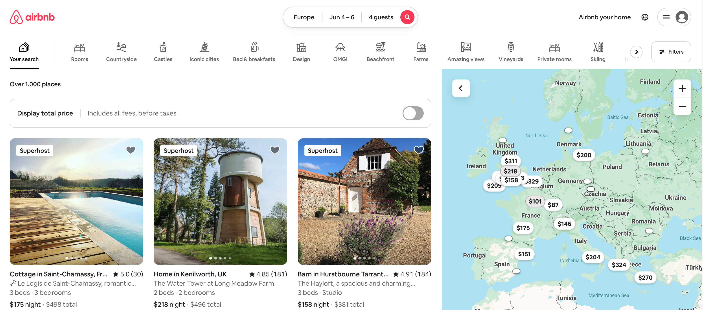

# Hostshare Engineer Candidate Project

This is a developer candidate project for [Hostshare](https://www.hostshare.co/), built by Darryl October.

The original build only too 2 days! A relatively short anount of time, given the number of features, screens and components. Even though I have 'completed' it, there are still a few things I would like to improve:

- [ ] The filters panel is very basic and can be improved a lot (e.g. with side scrolling, hover effects, active state, etc)
- [ ] Grid of rooms - the performance can be improved, optimization/lazyloading/catching of images. Also, smooth animation/fade-in and load styles would be cool, like on Airbnb.
- [ ] The gallery on the listing page can be improved a lot, especially on mobile. Also the images are not stretching and maintaining aspect ratio
- [ ] The UI library of choice (for some pre-built components) is [Shadcn/UI](https://ui.shadcn.com/). This is because it is sophisticated, modern, supports light/dark mode and has excellent component primitives, which just work. It is not the only option, however. There is some room to customize these UI components to meet the styles of Airbnb
- [ ] I didn't implement the amenities modal on the listing page
- [ ] The main nav can be improved a lot, but it at least works and looks generally fine on mobile
- [ ] Global spacing, margin, padding, font sizes, colours can also be improved

## Future Stuff

- [ ] Global `404` page and `500` error pages
- [ ] 🤔 Restructure non-routable components - It's not required, but as the project grows, I could reserve the `/app/*` folder only for routing and put components etc in a different location. More info [here](https://nextjs.org/docs/app/building-your-application/routing/colocation#store-project-files-outside-of-app
- [ ] Maps - add custom markers to the map on the search results page. The data is in the JSON feed


# Brief

_Build a functional search travel page and individual listing pages for Hostshare similar to Airbnb_

## **Base Requirements**

- **3 main pages:**
    - Index Page (Search Page/Grid)
    - Search Results Page
    - Listing Page
    
- **Index page:** should ****look like the airbnb home page
    - **Simple Nav**, Hostshare logo on left, search component in the middle, placeholder user avatar and menu on right (non-functional)
        - Search Component Notes:
            - Location search needs to be functional, but can be super simple. (only to search a list of cities within the payload).
            - Date picker - only worried about the ui, functionality of choosing dates and searching based on availability is not required
            - Number of guests - simple number picker will do
    - **Grid of listings:** with Image, Location name, nightly rate, any other details you find are useful from the payload
        - Listing should be clickable and navigate to listing page
        - Grid of listings should be responsive and have smooth transitions and style
    - **BONUS**: Categories and simple filters component similar to Airbnb

    

- **Search results page**
    - Similar to index page, but with filtered properties based on location, smooth page load after search
    - **BONUS**: Map - similar to airbnb

    

- **Listing page**
    - Header and title with relevant content (placeholders are fine)
    - Images and easy way to view them all
    - Home title with Host image
    - Description section
    - Amenities Section
    - Location Section
    - Reservation widget sticky on the right side beneath images (does not have to be functional, but should show check in and check out dates).
    - Well designed and responsive on mobile

    

- **Other things to note**
    - Use API payload here for listing data:
        [listings.json](https://s3-us-west-2.amazonaws.com/secure.notion-static.com/24643894-e5c3-4c40-974a-52594f581e03/listings.json)
        
    - Pay attention to little details to make this a smooth user experience. Things like how things hover, lazy loading pages, how modals look and work on desktop and mobile experience.

- **Specific Technology Requirements**
    - The front end must be built with any modern JS framework (Next.js/React.js is recommended) and UI Framework (recommended TailwindUI/CSS)
    - The backend, if necessary, can be built with any language (Typescript is recommended)
    - A database is not required, but if you’d like to use one you can use any database you are familiar with
    
- **Brand Resources**
    - The branding of the project should reflect Hostshare branding and green accent color

Brand Color: `#329a9a`


<aside style="padding: 1.5em; background-color: #333;">
✅ Deliverable details:

- A public URL to project demo that I can use and test
- Link to source code in a repository

**Answer these questions:** 

Throughout the project, which task or section proved to be the most complex, and how did you manage it? 

If you had more time and resources, what additional features or enhancements would you have liked to implement in this project? Why?

</aside>

---

## Getting Started

First install the dependencies using `npm`, `yarn` or `pnpm`

```bash
# Example
npm install
```

Then, run the development server:

```bash
npm run dev
# or
yarn dev
# or
pnpm dev
```

Open [http://localhost:3000](http://localhost:3000) with your browser to see the app


## Deployment

The project is deployed to Vercel. Merges to the `main` branch will automatically build and deploy a new version of the app.

